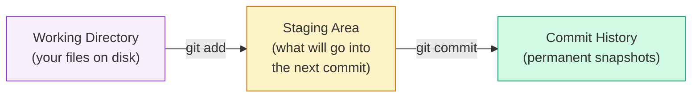
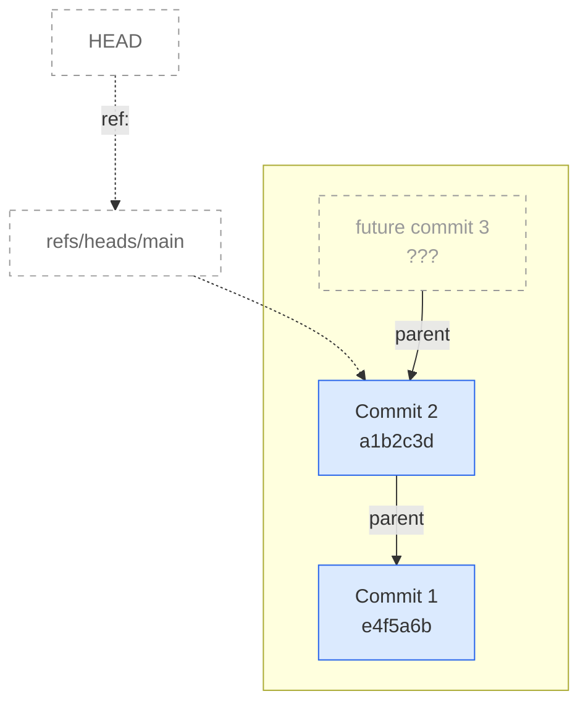
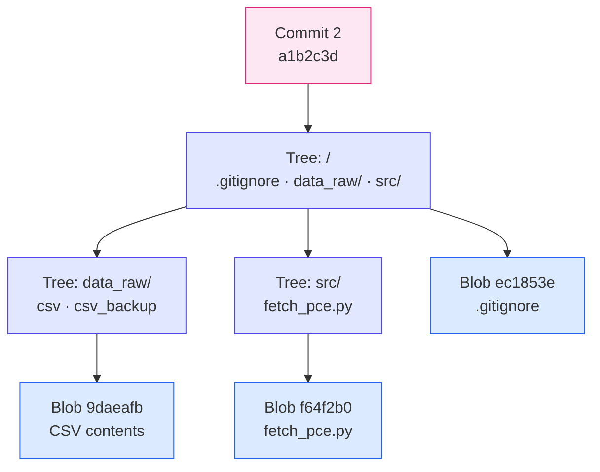
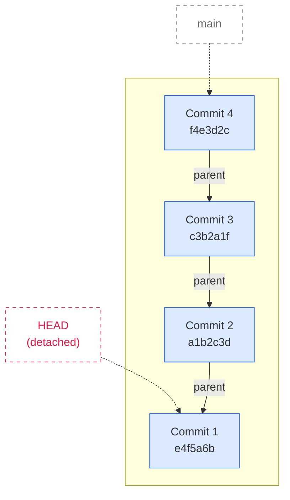
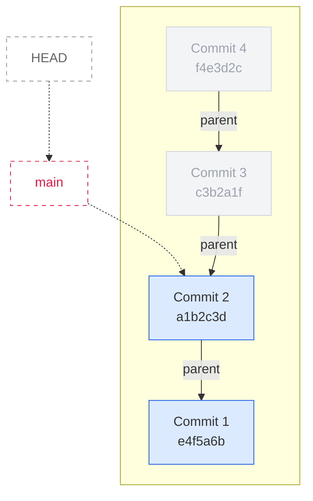

# Topic 3 — Git + Data Organization

## Overview

In Topic 2, the agent just dumped files wherever it wanted. That works, but is not a good idea long term. In this topic, we first ask the agent to help us organize a project properly, and then we learn git. Git is a version control that lets you save snapshots, see exactly what changed, and rewind to any previous state. When you're collaborating with a coding agent that rewrites files on your behalf, both are essential.

---

## 1. Project Organization

Before writing more code, let's ask the agent how to organize things. Give it the same task as Topic 2, but this time ask it to think about structure first:

```text
I want to use the FRED API key in the .env dir. Please download monthly data for personal
consumption expenditure from 1970 to 2024, save the data as a CSV, and generate a time
series YY-plot of the overlapping year-on-year changes. Before starting, how should I
organize the data and code and output in my project directory?
```

The agent will suggest a clean separation of config, raw data, processed data, figures, and scripts so the fetch step and analysis step stay reproducible. A practical layout looks like:

```text
fred_project/
├─ .env                  # API key — never committed
├─ .gitignore
├─ README.md
├─ requirements.txt
├─ src/
│  ├─ fetch_pce.py       # data download
│  ├─ transform_pce.py   # compute YoY changes
│  └─ plot_pce_yoy.py    # generate figures
├─ data_raw/             # exact API output
├─ data_processed/       # derived series
├─ outputs/
│  └─ figures/           # final plots
└─ notebooks/
   └─ exploratory.ipynb  # scratch work
```

The key principles:

- **Secrets** (`.env`) stay in the root, never committed — we'll enforce this shortly with `.gitignore`
- **Raw data** (`data_raw/`) is separated from **processed data** (`data_processed/`) so you can always re-derive; also important for replication
- **Scripts** are in `src/`, not scattered in the root
- **Outputs** (figures, tables) go in their own directory
- **Notebooks** are for exploration; production code lives in scripts

This is a good starting point. Now: how do we make sure we can undo mistakes and never lose working code?

---

## 2. Why Git?

You've seen this before:

```text
project/
├─ paper.docx
├─ paper_final.docx
├─ paper_final_v2.docx
├─ paper_FINAL_FINAL.docx
├─ paper_FINAL_FINAL_actuallyFinal.docx
├─ paper_FINAL_FINAL_actuallyFinal_submitted.docx
└─ paper_FINAL_FINAL_actuallyFinal_submitted_revised.docx
```

Every "version" is a full copy of the file. You can't tell what changed between them without opening each one. And the disk fills up with redundant copies.

Git solves both problems:

- It stores only the **differences** between versions
- Every snapshot gets a unique ID so you always know exactly what changed and when
- You can **rewind** to any previous snapshot instantly

**Why this matters for coding agents:** Claude Code generates and rewrites code fast. One bad agent run can destroy a working script. With git, you just rewind to the last good commit. Without it, you're back to `paper_FINAL_FINAL_actuallyFinal.docx`.

---

## 3. The Three Areas

Git organizes your work into three areas:



- **Working directory** — the files you see and edit
- **Staging area** — a holding pen where you choose which changes to include in the next snapshot
- **Commit** — a permanent, labeled snapshot of the staged files

This separation gives you control: you can change ten files but only commit three of them.

---

## 4. Our First Commit

We'll build on the FRED exercise from Topic 2, now using our organized project structure.

### Initialize a repository

```bash
mkdir fred_project
cd fred_project
git init
```

The `git init` command creates a hidden `.git/` directory. This is where git stores everything. Take a peek:

```bash
ls .git/
cat .git/HEAD
```

`HEAD` is just a text file that says which branch you're on. That's it — no magic.

### Create the project files

First, create your `.env` file with your API key. You can do this in vscode or from the command line:

```bash
echo "FRED_API_KEY=your_key_here" > .env
```

Now use Claude Code to generate the fetch script. Tell it to follow the directory structure from Section 1:

```text
Using the FRED API key in .env, write a Python script in src/fetch_pce.py that downloads
monthly data for real personal consumption expenditure and industrial production from 1959
to 2024 and saves the result as a CSV in data_raw/. Create the directories if they don't
exist. Then run the script.
```

Claude will create `src/fetch_pce.py`, the `src/` and `data_raw/` directories, and run it to produce the CSV — all following the project layout we established.

### Check the status

```bash
ls -al
git status
```

`ls -al` shows all files including hidden ones (`.env`, `.git/`). `git status` shows what git thinks about them — you'll see **untracked** files for everything the agent just created. Git sees them but isn't tracking them yet.

### Protect your secrets with .gitignore

We do **not** want to commit `.env` — it contains your API key. Create a `.gitignore`:

```bash
echo ".env" > .gitignore
git status
```

Now `.env` has disappeared from the untracked list. Git will ignore it.

**File permissions:** `.gitignore` tells git to skip the file, but anyone with access to your machine can still read it. Lock it down:

```bash
chmod 600 .env
```

This restricts read/write to only your user account.

### Stage and commit

```bash
git add src/fetch_pce.py data_raw/ .gitignore
git status
```

The files are now in the **staging area** (shown in green). Commit them:

```bash
git commit -m "initial FRED fetch script and data"
```

---

## 5. Identical Content = One Blob

Before we start transforming the data, let's protect the raw source. A good practice is to keep a backup copy of raw data and make both copies **read-only**:

```bash
cp data_raw/fred_pce_indpro.csv data_raw/fred_pce_indpro_backup.csv
chmod 444 data_raw/fred_pce_indpro.csv
chmod 444 data_raw/fred_pce_indpro_backup.csv
```

Making raw data read-only ensures you never accidentally overwrite your source. Any results you produce can always be replicated from this original data. If you need to re-fetch, you'd deliberately `chmod` it writable first. It is very annoying when you have a table in an early draft that you are not able to replicate later due to data updats.

Now stage and check what git sees:

```bash
git add .
git ls-files --stage
```

Look at the SHA hashes: **both CSV files have the same SHA**. A SHA (Secure Hash Algorithm) is a fingerprint for data: git feeds the file's contents through a hash function and gets back a fixed-length string like `a1b2c3d...`. The same contents always produce the same hash, and even a one-byte change produces a completely different one. Git uses these SHAs as IDs for everything it stores.

Because both CSV files have identical contents, they produce the same SHA. Git stores the file data in only one blob. This is **content-addressed storage**: the hash is computed from the file's contents, not its name.

Contrast this with the `paper_FINAL_FINAL.docx` approach, where every copy doubles the disk usage. Git is smarter.

Commit:

```bash
git commit -m "add backup of raw data, make read-only"
```

---

## 6. Under the Hood

We now have two commits. Let's look at what git actually stored.

```bash
git --no-pager log --oneline
```

```text
a1b2c3d (HEAD -> main) add backup of raw data, make read-only
e4f5a6b initial FRED fetch script and data
```

{: .output }

Those short strings (`a1b2c3d`, `e4f5a6b`) are the first 7 characters of each commit's SHA. The log tells us that `HEAD` points to `main`, which points to commit `a1b2c3d`. Here's what that looks like:



`HEAD` is just a pointer — it tells git where you are. It points to a branch name (`refs/heads/main`), which points to the latest commit. Each commit points back to its parent. The next commit you make will become the new tip, with commit 2 as its parent.

You can follow this chain yourself:

```bash
cat .git/HEAD                 # "ref: refs/heads/main"
cat .git/refs/heads/main      # a1b2c3d... (commit 2's full SHA)
```

### What's inside a commit?

Now let's open up commit 2 and see what's inside. Use `git cat-file -p` ("pretty-print") with the SHA:

```bash
git cat-file -p a1b2c3d
```

```text
tree c7e934d...
parent e4f5a6b...
author Your Name <you@example.com> ...
committer Your Name <you@example.com> ...

add backup of raw data, make read-only
```

{: .output }

A **commit** stores: a **tree** SHA (the snapshot of your directory), a **parent** SHA (the previous commit), and the message. The tree SHA is the key — it's the snapshot of what your project looked like at this point.

### What's inside the tree?

Copy the tree SHA and inspect it:

```bash
git cat-file -p c7e934d
```

```text
100644 blob ec1853e   .gitignore
040000 tree 479cf3f   data_raw
040000 tree b7c8d9e   src
```

{: .output }

A **tree** is a directory listing. Each line maps a name to either a **blob** (a file) or another **tree** (a subdirectory). The `040000` prefix means directory; `100644` means file. This matches what you'd see with `ls`:

```text
fred_project/
├─ .gitignore        → blob ec1853e
├─ data_raw/         → tree 479cf3f
└─ src/              → tree b7c8d9e
```

{: .output }

### What's inside a sub-tree?

Let's drill into `data_raw/` using the SHA from the listing above:

```bash
git cat-file -p 479cf3f
```

```text
100644 blob 9daeafb   fred_pce_indpro.csv
100644 blob 9daeafb   fred_pce_indpro_backup.csv
```

{: .output }

Which looks like:

```text
data_raw/
├─ fred_pce_indpro.csv         → blob 9daeafb
└─ fred_pce_indpro_backup.csv  → blob 9daeafb
```

{: .output }

Both files point to **the same blob** (`9daeafb`). There aren't two copies of the data stored in git — there's one blob, and two tree entries that reference it. This is content-addressed storage in action: same contents, same SHA, same blob. Contrast this with the `paper_FINAL_FINAL.docx` world where every copy doubles the disk usage.

### The full picture

Here's what commit 2 contains — a tree that points to sub-trees and blobs:



Both `fred_pce_indpro.csv` and `fred_pce_indpro_backup.csv` in the `data_raw/` tree point to the same blob `9daeafb`. Git doesn't store duplicates — if the content is the same, it's the same object.

### Git Object Types

| Object     | What it stores                                                           |
| ---------- | ------------------------------------------------------------------------ |
| **Blob**   | Raw file contents, identified by its SHA                                 |
| **Tree**   | A directory listing — maps filenames to blob or sub-tree SHAs            |
| **Commit** | A snapshot: points to a tree, plus author, message, and parent commit(s) |
| **Tag**    | A named pointer to a commit (not demoed here)                            |

---

## 7. Making a Change

Now let's evolve the project — add the analysis script. Ask Claude Code:

```text
Write a script in src/plot_pce_yoy.py that reads the CSV from data_raw/, computes
year-over-year percent changes for both series, and saves an overlapping time series
plot to outputs/figures/. Use orange and teal for the line colors. Create directories
if needed. Then run it.
```

Stage and commit:

```bash
git status              # new untracked files
git add src/plot_pce_yoy.py outputs/
git commit -m "add YoY plot script and figure"
git --no-pager log --oneline       # three commits
```

Now let's also update the fetch script. Ask Claude Code:

```text
Change the start year in src/fetch_pce.py from 1959 to 1950.
```

Before accepting, look at the diff Claude shows you. You can also see it yourself:

```bash
git diff src/fetch_pce.py
```

`git diff` shows you **exactly** what changed — the two lines where the year was modified. This is far more useful than comparing `paper_final_v2.docx` to `paper_final_v3.docx`.

```bash
git add src/fetch_pce.py
git commit -m "change start year to 1950"
git --no-pager log --oneline       # four commits
```

---

## 8. Rewinding

This is the payoff — the reason we set all of this up. There are two ways to rewind in git.

### Two important pointers

Git tracks your position with two pointers:

- **HEAD** — "Where am I right now?" Usually points to a branch name.
- **Branch pointer** (`main`) — "What is the latest commit on this branch?" Moves forward every time you commit.

Right now they work together: HEAD → main → commit 4 (your latest). Let's see both ways to rewind.

### Look-back rewind (safe)

Suppose you want to check what the project looked like at commit 1 — maybe to verify the original fetch script before the agent changed it. First, find the SHA:

```bash
git --no-pager log --oneline
```

```text
f4e3d2c (HEAD -> main) change start year to 1950
c3b2a1f add YoY plot script and figure
a1b2c3d add backup of raw data, make read-only
e4f5a6b initial FRED fetch script and data
```

{: .output }

Now checkout the first commit:

```bash
git checkout e4f5a6b
```

Git will warn you about "detached HEAD" — this just means HEAD is pointing directly at a commit instead of at a branch. Here's what happened to the pointers:



**HEAD** moved back to commit 1, but **main** still points to commit 4. Nothing was lost. Your files on disk now reflect commit 1:

```bash
ls src/
```

```text
fetch_pce.py
```

{: .output }

No `plot_pce_yoy.py` — it didn't exist yet at commit 1. Now go back to the latest:

```bash
git checkout main
```

HEAD snaps back to main, which still points to commit 4. All your files are restored. This is a safe operation — you're just looking around, nothing is deleted.

### Destructive rewind (use with caution)

Sometimes you don't just want to look back — you want to **undo** commits entirely. Suppose Claude Code made a mess across the last two commits and you want to go back to commit 2 for real:

```bash
git reset --hard a1b2c3d
```

This moves **both** HEAD and main back to commit 2. Commits 3 and 4 are abandoned — the files they changed are gone from your working directory. This is destructive and cannot be easily undone.



Commits 3 and 4 still exist in git's object store temporarily, but nothing points to them anymore — they're effectively gone.

**When to use each:**

|                      | Look-back (`checkout`)                     | Destructive (`reset --hard`)                |
| -------------------- | ------------------------------------------ | ------------------------------------------- |
| **Moves HEAD?**      | Yes (detaches)                             | Yes                                         |
| **Moves main?**      | No                                         | Yes                                         |
| **Deletes commits?** | No                                         | Effectively yes                             |
| **Use case**         | "Let me check what this used to look like" | "The agent broke everything, throw it away" |

---

## 9. VS Code

Everything we did on the command line maps directly to VS Code's GUI.

### Source Control panel

Open the **Source Control** panel by clicking the branch icon in the left sidebar (or `Ctrl+Shift+G` / `Cmd+Shift+G`).

- **Status**: The panel shows modified, untracked, and staged files automatically — no need to run `git status`. File icons get color-coded badges: **U** = untracked, **M** = modified, **A** = added.
- **Staging**: Hover over a file under "Changes" and click the **+** icon to stage it. Click the **+** next to the "Changes" header to stage everything. You can also open a file's diff and right-click to stage individual lines or selections.
- **Committing**: Type your message in the text box at the top of the panel and click the checkmark (or press `Cmd+Enter` / `Ctrl+Enter`).
- **Diffs**: Click any modified file in the panel to open a side-by-side diff with red (removed) and green (added) highlighting. This is one of the biggest advantages of the GUI over the command line.

### Git Graph (extension)

VS Code does **not** have a built-in commit history viewer. Install the **Git Graph** extension:

1. Go to Extensions (`Cmd+Shift+X` / `Ctrl+Shift+X`)
2. Search "Git Graph" and install it
3. Click **Git Graph** in the bottom status bar

This gives you a visual commit chain generated live from your repository. Click any commit to see what files it changed and the full diff.

### Rewinding in VS Code

- **Look-back** (`checkout`): In Git Graph, right-click a commit → **Checkout**. VS Code will warn about detached HEAD. To return, click the branch name in the bottom-left status bar → select `main`.
- **Destructive** (`reset --hard`): In Git Graph, right-click a commit → **Reset Current Branch to This Commit** → select **Hard**. Same warning as the CLI — this is irreversible.

### CLI vs GUI

| Operation  | CLI                                 | VS Code                                        |
| ---------- | ----------------------------------- | ---------------------------------------------- |
| Status     | `git status`                        | Source Control panel (always visible)          |
| Staging    | `git add <file>`                    | Click **+** on a file, or stage selected lines |
| Diffs      | `git diff`                          | Click a file for side-by-side color view       |
| Committing | `git commit -m "..."`               | Type message + checkmark                       |
| History    | `git log`, `git cat-file`           | Git Graph extension                            |
| Rewind     | `git checkout` / `git reset --hard` | Right-click in Git Graph                       |

The CLI teaches you what git is doing. The GUI makes it faster once you understand it.

---

## Further Topics

There is much more to git that we won't cover here. Some topics that are worth learning as your projects grow:

- **GitHub** — cloud synchronization and collaboration. Push your local repository to GitHub so it's backed up remotely and others can access it. This is also how you submit and share work.
- **Branching** — create offshoots of `main` to work on a feature or fix in isolation, then merge it back when it's ready. Useful when multiple people (or agents) are working on the same codebase.
- **Cloning** — download someone else's remote repository to your machine. This is how you use open-source code, starter templates, and shared course materials. This is how I made this course website: clone a repository and create markdown files for each topic. You can see the [commit history for this site on GitHub](https://github.com/sjoslin/USC.FBE.633.26.01/commits/main).

These are useful, but in this course we focus on the tools most useful for safe and efficient use of coding agents: committing, diffing, and rewinding.

---

## Key Concepts

| Concept               | What it means                                                   |
| --------------------- | --------------------------------------------------------------- |
| **Blob**              | Raw file contents, stored by hash                               |
| **Tree**              | A directory — maps filenames to blobs or sub-trees              |
| **Commit**            | A snapshot pointing to a tree, with metadata and a parent       |
| **HEAD**              | Pointer to your current position (usually a branch)             |
| **Ref**               | A human-readable name (like `main`) that points to a commit SHA |
| **Content-addressed** | Identical content = same hash = stored once                     |
| **Detached HEAD**     | You're looking at a specific commit, not a branch               |
